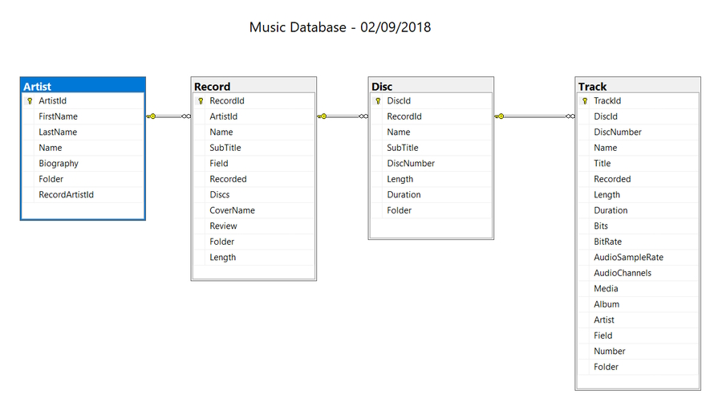

# Music Database test routines

## Packages to install

* Install-Package System.Data.SqlClient
* Install-Package System.Configuration.ConfigurationManager
* Install-Package Dapper
* Install-Package Dapper.Contrib
* Install-Package Newtonsoft.Json
* Install-Package FastMember

This project is only being used to test functions that I need to add to my Music Database project.

## Serialisation

These routines show how to serialise a list of entities from a database into JSON format. It also deserialises JSON from files in the current folder so that I can use them to bulk copy back into the database.

The first section is used to serialise the data from the ``Artist``, ``Record``, ``Disc`` and ``Track`` tables. This code is commented out because I don't need to run it again.

The next part of the program deserialises the JSON data from files I have saved in the current folder.

## Bulk insert

**Important Note:** for testing purposes I was recreating the Music database so I had to truncate all tables. I then deleted all table joins in the Database Diagram. Once I did this I removed all of the Primary Keys from the tables. I had to do this because my Music Database program generated all of the Id's for each table.

The third part is used to bulk copy the Lists of entities into the database. These are also commented out so that I don't run them twice.

**Note:** I had problems writing the data into the Disc table. This was caused by the ``disc.Duration`` field. I am using a **TimeSpan** field in the ``Disk`` class (I don't call it Disc because this is a keyword and it causes problems) and a ``Time`` field in the SQL Server table. I found that I had two folders with music files that were more than a day duration and Time can only store up to 24 hours. To get around this I just chopped a day off the duration (total time length of the tracks in the folder).

An interesting point to note is that each entity has a ``BulkInsert()`` method and each use a different method of bulk copying.

I entered my SQL table structures into ChatGPT and asked it to create the bulk copy methods for me. To my surprise each method used different code.

### Artist

Artist was the most complicated method. It added my list of entities into a data table and I had to write a stored procedure to insert each record.

I had to add a stored procedure parameter, ``@artists`` which was the dataTable.

```sql
    ALTER PROCEDURE [dbo].[adm_InsertArtists]
        @artists dbo.ArtistType READONLY
    AS
    BEGIN
        SET NOCOUNT ON;

        INSERT INTO Artist (ArtistId, FirstName, LastName, Name, Biography, Folder, RecordArtistId)
        SELECT a.ArtistId, a.FirstName, a.LastName, a.Name, a.Biography, a.Folder, a.RecordArtistId
        FROM @artists a;
    END
```

To be able to use this in SQL Server I had to create a user defined table type.

```sql
    CREATE TYPE [dbo].[ArtistType] AS TABLE
    (
        [ArtistId] [int] NOT NULL,
        [FirstName] [nvarchar](50) NULL,
        [LastName] [nvarchar](100) NOT NULL,
        [Name] [nvarchar](100) NULL,
        [Biography] [nvarchar](max) NULL,
        [Folder] [nvarchar](400) NULL,
        [RecordArtistId] [int] NULL
    )
    GO
```

### Track

Track was the simplest bulk insert method and will be the one I use in the future. It didn't require a stored procedure or a user defined table type. It uses the ``FastMember`` package and an ``ObjectReader`` to read in the list of entities.

## Completing database tasks

I need to add the Primary Keys back into each table once I have inserted all of the data. I do this in the Track, Disc, Record, Artist order.

I also need to turn on the Identity Specification for each table and set **Is Identity** to yes.

Finally I need to rejoin all of the tables by **Id** in the Database Diagram.


